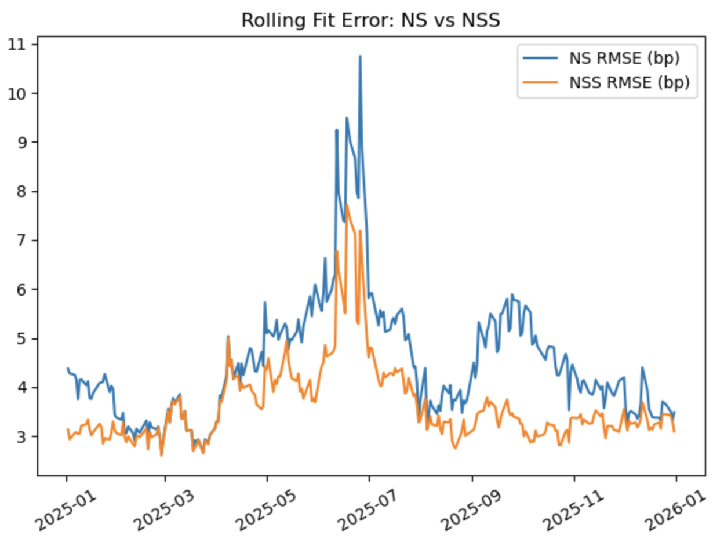
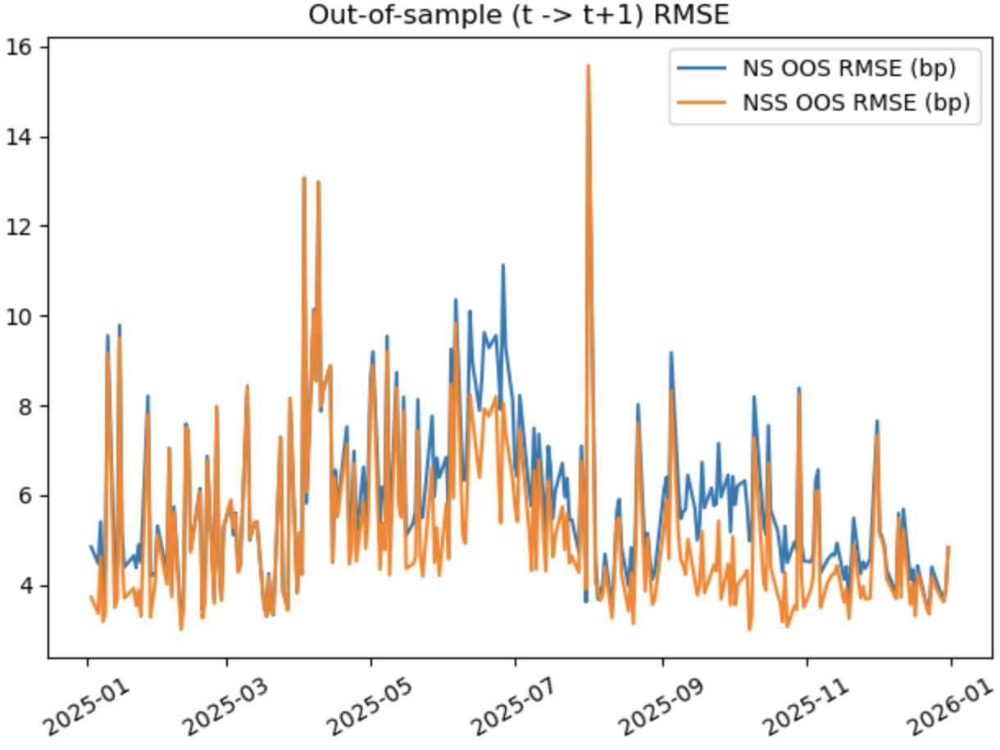
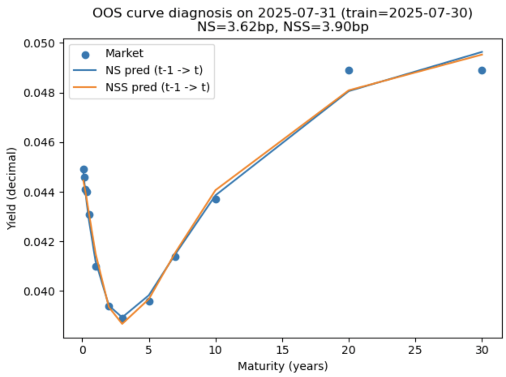

# U.S. Treasury Yield Curve Fitting with Nelson-Siegel and Nelson-Siegel-Svensson

A quantitative finance project that fits U.S. Treasury par yield curves using the Nelson-Siegel (NS) and Nelson-Siegel-Svensson (NSS) models, and compares their in-sample and out-of-sample performance on rolling daily data.

---

## Project Overview

This project studies daily U.S. Treasury yield curve data and applies two widely used parametric term-structure models:

- **Nelson-Siegel (NS)**: a simple, empirical and power ful model capturing level, slope, and curvature of the yield curve. It uses so-called basis function to approximate numerically the non-linear shape of the yield curve.
- **Nelson-Siegel-Svensson (NSS)**: an extension of NS that adds an additional fourth factor (curvature component), allowing more flexibility in modeling/fitting complex curve shapes. It's nowadays the market standard for yield curve modeling and used, e.g., by the ECB.

The goal is not only to fit one-day yield curves, but also to analyze how model parameters evolve over time and whether the more flexible NSS model improves **out-of-sample** prediction.

---

## What I Implemented

### 1) Single-day curve fitting (NS vs NSS)
- Extracted one selected trading day from U.S. Treasury daily par yield curve data
- Fitted NS and NSS parameters via nonlinear least squares
- Compared fitted curves and residual errors by tenor

### 2) Rolling daily estimation (2025 sample)
- Estimated NS parameters daily over the full sample period
- Built parameter time series such as:
  - `beta0(t)` (long-term level proxy)
  - `beta1(t)` (slope component)
  - `beta2(t)` (curvature component)
  - `lambda(t)` (decay parameter)
- Evaluated fit quality using daily RMSE (in bp)

### 3) NSS extension and parameter diagnostics
- Implemented rolling NSS estimation with parameter bounds and initialization strategy
- Monitored optimization stability and boundary-hitting behavior (e.g., lambda / mu upper bounds)

### 4) In-sample model comparison (NS vs NSS)
- Compared daily in-sample RMSE (bp)
- Computed RMSE gain of NSS over NS across the sample

### 5) Out-of-sample (t -> t+1) evaluation
- Used parameters estimated on day `t` to predict the yield curve on day `t+1`
- Compared NS vs NSS out-of-sample RMSE (bp)
- Measured how often NSS improves OOS performance

### 6) Tenor-wise error diagnostics on difficult dates
- Identified dates where NSS underperformed NS out-of-sample
- Diagnosed tenor-level errors to understand which maturities drove the underperformance

---

## Data

- **Source:** U.S. Treasury Daily Par Yield Curve Rates (CSV download from [Treasury website](https://home.treasury.gov/resource-center/data-chart-center/interest-rates/TextView?type=daily_treasury_yield_curve&field_tdr_date_value=2025))
- **Frequency:** daily with 249 entries in total
- **Maturities used:** 1M, 2M, 3M, 4M, 6M, 1Y, 2Y, 3Y, 5Y, 7Y, 10Y, 20Y, 30Y (depending on availability)
- **Sample used in rolling analysis:** 2025 daily observations (business days)

> Note: This project uses **par yield curve rates** rather than a zero-coupon / spot curve. This is sufficient for model-fitting comparison and parameter dynamics analysis, but it is not a full no-arbitrage term-structure estimation pipeline.

---

## Modeling Idea (Brief)

- **NS** is used as a compact representation of the yield curve shape with a small number of interpretable parameters.
- **NSS** extends NS by adding one more curvature term, which can improve fit when the curve shape is more complex.
- The trade-off is:
  - **NS** = simpler, more stable
  - **NSS** = more flexible, but potentially more prone to overfitting / unstable extrapolation in some periods

This project explicitly tests that trade-off using both **in-sample** and **out-of-sample** comparisons.

---

## Key Results (2025 Sample)

### In-sample fit
- NSS generally improves in-sample RMSE relative to NS.
- In my sample, NSS improves in-sample RMSE on almost all days.

### Out-of-sample (t -> t+1)
- NSS improves out-of-sample RMSE on most days, but not all.
- In my run, **NSS improves OOS RMSE on ~91% of days**.

### Diagnostic insight
- On dates where NSS underperforms, the issue is often concentrated in specific tenors (especially some short-end / key maturity points), rather than a uniform deterioration across the curve.

> These results illustrate a useful practical point: **better in-sample fit does not guarantee better short-horizon prediction every day**.

---

## Visual Highlights

### Rolling parameter example (NS)


### In-sample RMSE comparison (NS vs NSS)


### Out-of-sample RMSE comparison (t -> t+1)


### (Optional) Tenor-wise error diagnostics on a worst OOS date


---

## Repository Structure

```text
us-treasury-yield-curve-ns-nss/
├── README.md
├── .gitignore
├── requirements.txt
├── data/
│   └── daily-treasury-rates.csv
├── notebooks/
│   └── Nelson_Siegel.ipynb
└── figures/
    ├── ns_parameter_timeseries.png
    ├── insample_rmse_ns_vs_nss.png
    ├── oos_rmse_ns_vs_nss.png
    └── tenor_oos_diagnosis_worst_date.png
```

---

## How to Run

### 1. Clone this repository
```bash
git clone <your-repo-url>
cd yield-curve-ns-nss
```

### 2. Install dependencies
```bash
pip install -r requirements.txt
```

### 3. Prepare data
Download the U.S. Treasury Daily Par Yield Curve Rates CSV and place it at:

```text
data/daily-treasury-rates.csv
```

### 4. Open and run the notebook
Use Jupyter Notebook / JupyterLab and run:

```text
notebooks/Nelson_Siegel.ipynb
```

---

## Main Outputs in the Notebook

The notebook includes:
- cleaned tenor/yield tables for selected dates
- NS and NSS fitted parameters
- fitted curve plots
- rolling parameter time series
- in-sample RMSE comparison
- out-of-sample (t -> t+1) RMSE comparison
- tenor-wise diagnostics for worst-performing OOS dates

---

## Notes / Limitations

- Uses **par yields**, not bootstrapped zero-coupon yields
- Uses daily cross-sectional fitting with nonlinear least squares (not state-space / Kalman filtering)
- Out-of-sample test is a simple **t -> t+1** prediction setup
- Parameter estimates can be sensitive to initialization and bounds (especially in NSS)

---

## Possible Next Steps

- Bootstrap zero-coupon spot curves first, then fit NS/NSS to spot rates
- Compare NS/NSS with spline-based curve fitting
- Model parameter dynamics (e.g., AR/VAR) and forecast multi-day horizons
- Add regularization or parameter smoothing across time
- Refactor notebook code into reusable `src/` modules

---

## Author

This project was developed as part of my quantitative finance learning / portfolio building, with a focus on fixed income modeling, term-structure analysis, and model diagnostics.
